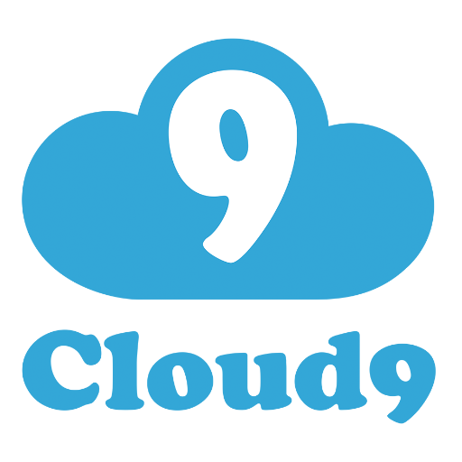

Few months ago I attended a [coding competition][2]. In the end of the event the winners demonstrated one of their tools: the [Cloud9 editor][3]. Then it hit me — I had to experiment with it! Later I used it working on various projects in my free time. Here I'm going to share my experience so far — I'm a happy user :)

### Cloud9 is great

So far, I've found several key points/facts why I consider the editor to be truly astounding tool:

1. Accessibility and User/Developer experience
2. [Pair programming][4] and education
3. Collaboration and open source

### Accessibility

The tool is currently [free][5] and [open source][6]. Even if you're not a technical person you already have reason #1 to either make a [new registration][7] or use your existing code-oriented account to [log in][8] to the service. (No affiliation in the links) If you are non-technical, but very business person, you might know that [Amazon will probably grow Cloud9 in the future][9].

On the other hand, if you are a technical person and you take a closer look, you'll see that it's a charming service of [ace][10] which directly accesses [docker][11] instances. The first time I showed a working [workspace][12] to a friend developer telling him to use the environment just as Ubuntu — the response was something like

Later, he setup all his bash aliases and specific configurations and started to work with the terminal just as he's working with his own Linux machine :)

### Pair programming and education

As soon as the environment was ready (understand having all the aliases and custom shell scripts, drush, drupal console, etc. cli tools) we went into using some of the [collaboration features][14]. I will not put a meme here, but I'll tell you this: the experience is very similar to using Google Drive for collaborating on documents in real-time, so if you like this — you'll surely like this real-time coding experience too!

[Pair programming][4] on same git branch and code base is not something we usually do for various reasons, but if you like doing it, or you need to do it — I'd definitely recommend you Cloud9. You can pair program remotely just as you'd normally do on 1 computer: sharing terminal, files, git branches, etc.

From these pair program opportunities come also very interesting education opportunities. For example, [CS50][15] and [freeCodeCamp][16]. These are good case studies of the cloud editor to encourage people of all walks of life to give programming a try and learn their [preferred programming language][17] without any special computer hardware requirements, i.e. they can code real applications in the browser.

### Collaboration and open source

Because the service is free and very fun to use, it's naturally an optional tool when working on various projects requiring tight collaboration such as open source projects.

For example, I decided to work on [swagger-jsdoc][18] node module which I used for a small project. All I had to do to make a pull request is:

1. Make a new workspace (new virtual machine in the cloud)
2. Git clone the fork repository
3. Create a new branch and do your task
4. Push back to fork repository and open a pull request

Note that I didn't even have to install any software, all I had to make this contribution was to open my browser and use Cloud9 as a cloud service.

### Keybindings

These are some of the items I'm using quite often and sometimes get a WOW effect from people watching me doing things like that in my browser:

* [Multiple cursors][19] (yep, [sublime][20] is to blame for our expectations)
* Command line tricks work just well (Ctrl+U, Ctrl+L)
* [Find in tree][21] (and others)
* [Search/Find][22] is handy working with namespaces

I think normally people don't expect a full IDE experience in the browser, as I didn't too, and that's the reason I mentioned Docked previously for an eye-opener. Just by the way, PHP developers might be even more surprised with things like [xdebugger][23] being available in their development environments.

### Setting up Drupal 8

This might come even more shocking for people having an idea what [Drupal][24] is. It's an association of heavy CMS with high resource demand.

Yet, do the following the sake of having your WOW moment yourself:

1. Create a new workspace based on [Drupal Composer][25] github repository
2. Follow the instructions to run an installation from the cli or the web (you might need to read [this MySQL][26] article if you don't have the idea to see your [environment variables][27] from the command line.
3. Profit from having a running Drupal 8 which uses [Composer][28] scripts for managing modules and dependencies to external libraries.

[1]: https://cdn-images-1.medium.com/max/800/1*uc-REJYHbk02nuzVQmDHHQ.png
[2]: https://medium.com/@kalin.chernev/coding-battle-at-microsoft-innovation-center-brussels-the-rise-of-the-bots-f0887c15e257
[3]: https://c9.io
[4]: https://en.wikipedia.org/wiki/Pair_programming
[5]: https://c9.io/pricing
[6]: https://github.com/c9
[7]: https://c9.io/signup
[8]: https://c9.io/login
[9]: https://c9.io/blog/great-news/
[10]: https://ace.c9.io/#nav=about
[11]: https://www.docker.com/
[12]: https://docs.c9.io/docs/create-a-workspace
[13]: https://cdn-images-1.medium.com/max/800/1*DBGdHlkB6DVjBy62d3TANQ.gif
[14]: https://docs.c9.io/docs/share-a-workspace#section-collaboration-features
[15]: https://cs50.harvard.edu/
[16]: https://www.freecodecamp.com/challenges/start-a-nodejs-server
[17]: https://docs.c9.io/docs/supported-languages
[18]: https://github.com/Surnet/swagger-jsdoc
[19]: https://docs.c9.io/docs/multiple-cursors
[20]: https://www.sublimetext.com/
[21]: https://docs.c9.io/docs/keybindings
[22]: https://docs.c9.io/docs/find-and-replacing-in-files#find-in-files
[23]: https://c9.io/blog/debug-your-php-code-with-xdebug-and-cloud9/
[24]: https://www.drupal.org/
[25]: https://github.com/drupal-composer/drupal-project
[26]: https://community.c9.io/t/setting-up-mysql/1718
[27]: https://help.ubuntu.com/community/EnvironmentVariables
[28]: https://getcomposer.org/
[29]: https://cdn-images-1.medium.com/max/800/1*12EXDc2rgRcy11wQk4SVjA.png
